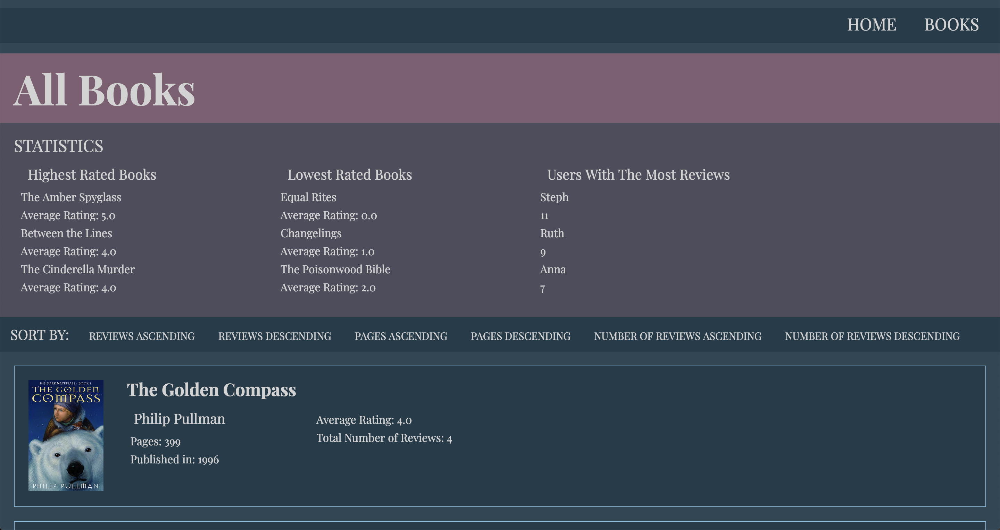
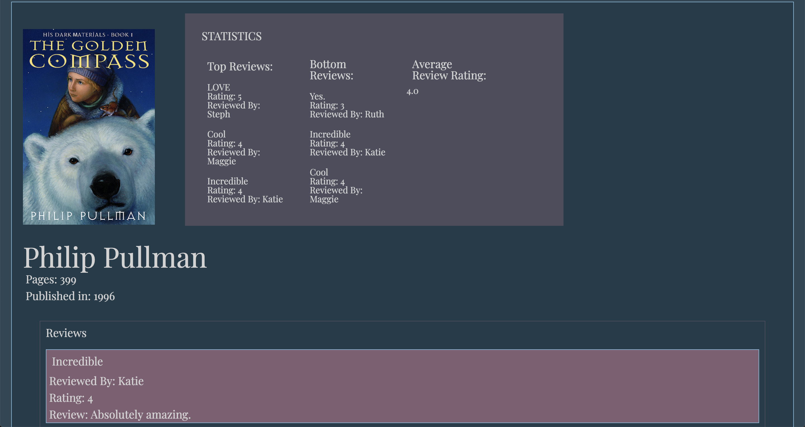

# Book Club

Book Club is a paired project from Module 2 of the [Back-End Engineering Program](https://turing.io/programs/back-end-engineering/) at the [Turing School of Software & Design](https://turing.io/). The project specifications can be found [here](https://github.com/turingschool-projects/BookClub). This is a Ruby on Rails application where users can browse books and their authors, and leave reviews for the books. You can see the beautifully deployed site [here](https://infinite-harbor-31716.herokuapp.com/).




## Features
This project covers the basics of a Rails web application, with show and index pages for books, show pages for authors and users, and Create/Read/Delete functionality for books, authors, users, and reviews. The project also makes use of ActiveRecord to build out some statistics, such as: 
* Highest Rated Books
* Lowest Rated Books
* Users with the Most Reviews
* Average Review Rating per Book
Users are also able to sort books by number of pages, review rating, etc. In addition, the site emphasizes reasonable UI/UX, with basic styling and layout, a complementary color scheme, and fully built out links to all areas of the site. 



### Learning Goals
* Creation of a basic Rails web application
* Implementing basic MVC structure to your project
* Save and retrieve data from a database
* Display content on a web page with some very basic styling
* Learning how to test your code effectively at a Controller and a Model level

## Installation
### Local Setup
If you wish to install this app locally, you can fork or clone the repository here. Make sure you are running the correct versions of Ruby and Rails, indicated below. Installation steps once cloned are as follows: 
Install the gem packages
```
$ bundle install
```

Set up the database
```
$ rake db:create
$ rake db:migrate
$ rake db:seed
```

Run the server
```
$ rails s
```

Visit `http://localhost:3000` in your browser and you should see the locally deployed site!

### Running Tests
Once the app is installed locally, you can run the test suite: 
```
bundle exec rspec
```

## Built With: Technologies and Versions
* [Ruby 2.4.5](https://ruby-doc.org/core-2.4.5/)
* [Rails 5.1.6](https://guides.rubyonrails.org/)
* [Heroku](https://www.heroku.com/)
* [RSpec](http://rspec.info/)
* [Capybara](https://github.com/teamcapybara/capybara/blob/3.12_stable/README.md)


## Authors
**[Anna Smolentzov](https://github.com/asmolentzov)**

**[Mary Goodhart](https://github.com/mgoodhart5)**

## Acknowledgements
We would like to thank our fantastic Mod 2 instructors [Dione](https://github.com/dionew1) and [Ian](https://github.com/iandouglas) for your help with this project and in general at Turing!
